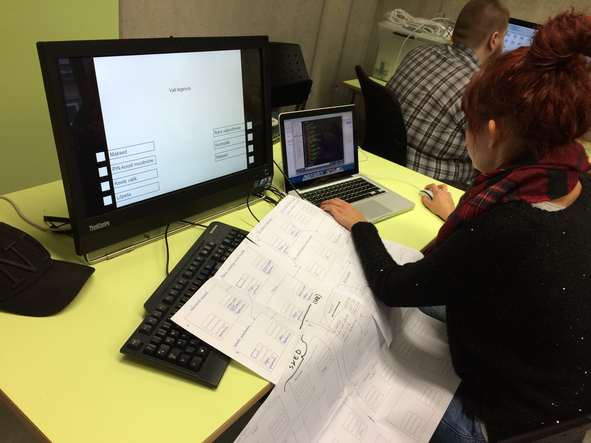

## ATM prototype 2015

### About

This is the student project for studiyng and designing interactions for ATM machines.

### Installing and running

If you have Git and NodeJS installed, run the following commands:

    git clone https://github.com/kuressaareametikool/atm
    cd atm
    npm install
    node server.js

Note that you can change the port number: ```node server.js portnumber```.

Alternatively, just download the project to your local web server and point the browser to 
```public``` subdirectory, no NodeJS nor Git is neccessary.

### Running with smartcard support

    npm install node-pcsc
    node server-card.js

### Viewing

To view different ATM versions, add **?bank=insert-bankname-here** in the URL string. The name
has to match with the corresponding ```.yml``` and ```.css``` files in ```/public/banks/``` directory.

### Editing

To edit different ATM versions, edit the corresponding yml and css files in ```/public/banks```.
 directory.

### Workflow

To regulary update the data files from the local network one can use following script(s):

    var exec = require('child_process').exec

    var path = '/Volumes/dk/Projektid/MK-13/veebitehnoloogiad/'

    setInterval(function() {

    var command1 = 'cp ' + path '*.css public/banks/.'
    var command2 = 'cp ' + path + 'states-* public/banks/. && cat $(ls -t -1 public/banks/states-* | sort) > public/banks/states_all.yml'

    child = exec(command1,
     function (error, stdout, stderr) {
        console.log('Updating files')
        console.log(stdout);
        console.log(stderr);
    });

    }, 3000)
